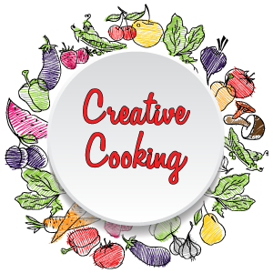
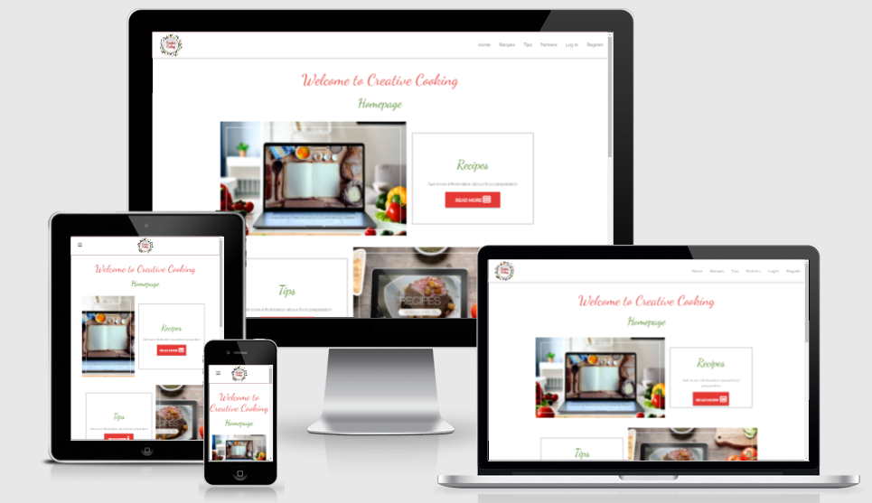
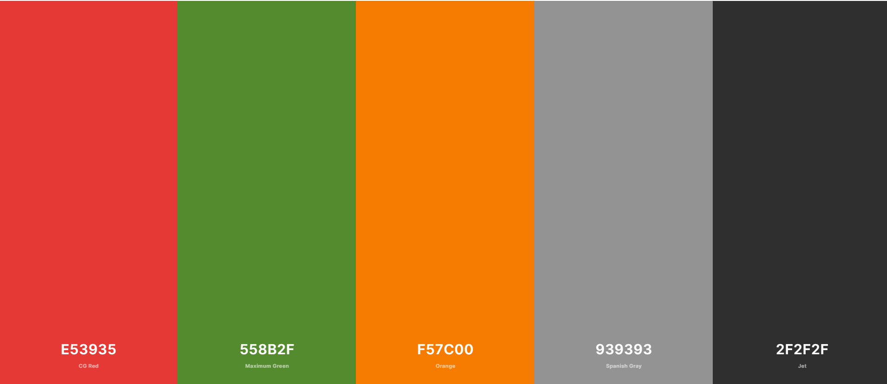
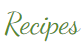
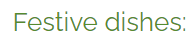
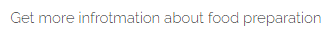
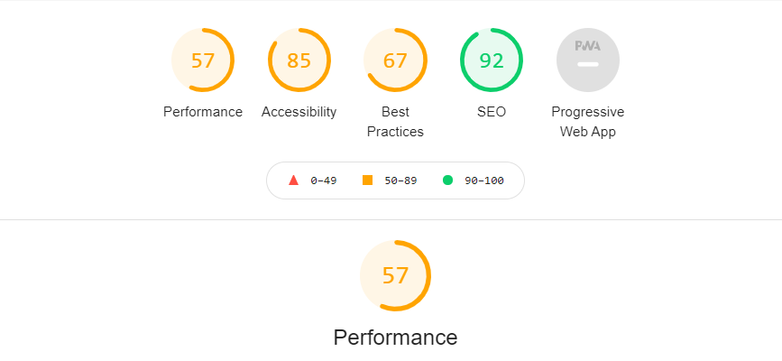

# milestone-project-03 
# Backend Development / Creative Cooking

[Live site on Heroku Pages](http://milestone-project-03-ac.herokuapp.com/get_homepage)

# Author
Andrej Cybovskij

## Project Overview

- Below is a picture of site that shows it in responsive states. 
[link to check a website to be responsive](http://ami.responsivedesign.is)

- Creative Cooking is an online cookbook website. 
- The main idea of this website is to allow users to find and share different kind of recipes. Everybody have possibility to search and use recipes from this website. To share their own recipes, every potential user needs to create personal account and add recipes for sharing. As well, registered users could manage their recipes from their personal profile. That includes updates and delete recipes. 
- Website recipes have a categories and cuisines options to choose. The website admin only has access to manage categories and cuisines groups. He can add, update or delete them. 
- The website has a dashboard with some stats information about recipes placed in the website.
- As well, website has a page with links to promote partners websites.

- [Link to a deployed website](https://milestone-project-03-ac.herokuapp.com/get_homepage)

## UX

### Project Goals

#### The goals of this project are:
- Design, develop and implement a full-stack site that allows users to manage a common dataset about a particular domain.
- Design, develop and implement a web application using HTML, CSS, JavaScript, Python-Flask and MongoDB technologies
- Meet the target audience users’ needs using UI/UX design principles
- Test a full-stack front-end web application through the development, implementation and deployment stages
- Deploy a front-end web application to a Cloud platform (Heroku)
- Demonstrate and document the development process through a version control system
- Learn Python+Flask theory and practically implement all gained knowledge

#### User Goals

- The target audience of this website is quite wide. They are different age, status, families or single people.

Common types of users are:
- **New customers.** The users’ main goal is to get a necessary recipe. They are ready to search and discover new recipes. As well, they could wonder how to share their recipes on this website. They need to get login information and discover user’s dashboard functionality, how to add their recipes to the system
- **Existing customers.** They knows website structure and knows how to login, search, add, update and delete recipes.
- **Admin.** He’s goal is to get access to the back end information to manage it. He needs to manage categories and cuisines such as create, edit update or delete them
- This website is proposing login system for users to create, update and delete user’s recipes.

#### Developer Goals
- Design, develop and implement a full-stack a MongoDB-backed Flask project for a web application that allows users to store and manipulate data records.
- Design and implement web application based on the best principles of user experience design, accessibility and responsivity.
- Design, develop and implement a web application using HTML, CSS, JavaScript, Python-Flask and MongoDB technologies.
- Designing a database structure well suited for the project.
- Create functionality for users to create, locate, display, edit and delete records (CRUD functionality).
- Clearly document process for the future usage and information.
- Use version control software (Git & GitHub) to maintain and share code with other developers.
- Test and deploy web application to a Cloud platform. (Heroku)
- Demonstrate abilities and knowledge gained during the course.
- Get experience in a project development.

#### Website Owner Goals
Main goals of website owner are:
- To represent website in a pleasant manner.
- Showcase existing recipes.
- To have properly working login system for user.
- To make information more structural.
- To attract users by presenting some stats information.
- To propose users some partners links.
- To represent contact information.

### User Stories

- As a user, I want to have:
  1. Ability to easily find out what or who the site is for.
  2. Ability to easily navigate the website.
  3. Ability to find recipes.
  4. Ability to get recipe's full details.
  5. Ability to create account.
  6. Ability to update account.
  7. Ability to login into account.
  8. Ability to add new recipe.
  9. Ability to edit my recipe.
  10. Ability to get in touch with website admin or owner.

### Design Choices
This project was created based on the target audience needs and requirements. The target audience is a quite wide range of people who likes to cook. Based on the website theme, were chosen Red, orange and green colors as a main brand colors. They are associated with food and takes attention to themselves. The food theme involves visual attraction to the user that mean website should contain a lot of food imaginary but not overload attention. However existing trends like to use clean and simple design. As a small piece of attraction, website’s buttons contains corresponding icons. According to user requirements, website should stay useful, usable and valuable for everybody. To achieve value from design were used user experience five planes:

- **Strategy Plane**  – aiming to achieve in the first place and for whom. The users of this website are people who likes to cook and share their ideas. The website should be quite simple and universal for everybody. Navigation is used quite standard and known by every online users. Traditional rule is no more than 3 clicks to search or get other information.

- **Scope plane** - represents features we want to include into design. 
  - This project includes following features: 
      - Header navigation.
      - Mobile navigation.
      - Registration system.
      - Login functionality.
      - Create, Read, Update and Delete functionality.
      - Intuitive design.
      - SVG logo on top of the page.
      - Grid/Card images as a visual representatives.
      - Search functionality.
      - Contact form.
      - Social media icons.

- **Structure plane** - this project’s information is structured and logically placed into the main navigation. As well, this project’s content is taken from the MongoDB database. The structure of Database tables are presented in this [link to a database schema](DATABASE.md).

- **Skeleton plane** - part for mock-ups:
  - Wireframes links are presented below:
    - [Link to a Wireframes for a Desctop view](assets/documents/project-3-desctop-wireframes.pdf)
    - [Link to a Wireframes for Tablet view ](assets/documents/project-3-tablet-wireframes.pdf)
    - [Link to a Wireframes for Mobile view ](assets/documents/project-3-mobile-wireframes.pdf)

- **Surface plane** - it is a final part of design procedure. The project is built in Classical design style with infusions of modern elements. This project is orientated more into the data manipulating. However, the website stays useful, usable and valuable for everybody.

#### Colors
The color palette were created according to people association with the food and professional information from the [Jenn David Design](https://jenndavid.com/colors-that-influence-food-sales-infographic/), food packaging Design Company that has over 20 years of successful experience partnering with specialty food brands.

- The color brand one is Red color (CG Red). It is using for many titles and buttons to attract attention. According to Jenn David Design: Red and yellow are the chief food colors, evoking the taste buds and stimulating the appetite. Both red and yellow are also effective at grabbing attention.
- The color brand two is Green color (Maximum Green). It is used for titles, subtitles, and buttons. According to Jenn David Design: Green color is connotes with eco-friendliness, healthy (think veggies).
- The color brand three is Orange color. It is used for hover statements and for user navigation links, to attract attention. According to Jenn David Design: Orange color is a blend of red and yellow, naturally lends itself to food as another appetizing color.
- The color brand four is Spanish Grey color. It is used as neutral base color and some lines color.
- The color brand five is a Jet Grey color. It is dark color and used for main content font and all dark design elements to make them visible to user.

- Color palete was created using [Coolors resources](https://coolors.co)
- 

#### Typography
- Raleway sans-serif typeface family font, were using in this project for the body text. Body font size is 16px. This body font is easy to read and good for design. It is very universal and has very wide range of font weights.
- All titles H1, H2 and H3 are in Dancing Scrip cursive font’s family.
- All H4 titles are in Raleway sans-serif typeface font’s family.
- According to Google Font, Dancing Script is a lively casual script where the letters bounce and change size slightly. Caps are big, and goes below the baseline. This font is associated with handwriting and is a good choice for recipe book titles. It is similar in style to everybody own hand written recipe book.
-  H1 as main title is in size of 52px. It is quite big size, but looks very stylish and attract attention. H2 title is in size of 42px. H3 titles are in size of 32px. H4 titles are in size of 26px.
- All fonts are reduced in size for mobile devices to fit into the small screen of devices:
- H1 = 40px, H2 = 30px, H3 = 25px, H4 = 22px.
- body font is in same size for mobile devices.

- Font examples are presented below:
- H1 Dancing Scrip 50px 
- H2 Dancing Scrip 40px 
- H3 Dancing Scrip 30px 
- H4 Raleway 26px 
- Paragraph (body) Raleway 16px 
- [Dancing Scrip font can be found here](https://fonts.google.com/specimen/Dancing+Script)
- [Raleway  font can be found here](https://fonts.google.com/specimen/Raleway)
 

#### Images
- To demonstrate main cooking/food theme, in this project were used lot of colourful images. 
- Font Awesome icons were used to visually represent all major social media resources and as additional information on buttons. 
- [Images and logo were taken from the Megapixl resources](https://www.megapixl.com)

#### Design Elements
List of all elements used on website: 
- top menu (desktop navigation)
- sidebar menu (mobile navigation)
- footer
- containers/cards
- progress bar
- buttons
- text input
- textarea inputs
- images (.png, .jpg, .svg)
- icons
- contact form

#### Animations
Project has a limited range of animations. It draws attention to the element.
- Animation is added to the following elements:
  - **Hover** state is used for all icons and buttons. On hover, they are changing background and text colors. Hover effect is added to top navigation elements too.
  - **Sliding from/to the left** animation is added to the mobile navigation.

### Wireframes

The wireframes were created using [Balsamiq](https://balsamiq.com/wireframes/) software. It was a part of Scope Plane of design process.
- Wireframes links are presented below:
- [Link to a Wireframes for a Desctop view](assets/documents/project-3-desctop-wireframes.pdf)
- [Link to a Wireframes for Tablet view ](assets/documents/project-3-tablet-wireframes.pdf)
- [Link to a Wireframes for Mobile view ](assets/documents/project-3-mobile-wireframes.pdf)

### Features

Following features will be used in this project:

  - Intuitive design. Design is clear and understandable.
  - Designed with HTML5, CSS, JavaScript and Materialize.
  - Fixed Header navigation. Simple and easy to navigate.
  - Mobile navigation (sliding from the left).
  - Clickable Header logo.  
  - Search functionality.
  - Registration functionality.
  - Login functionality.
  - Create,read, update and delete functionality for the user.
  - Database connection and data handling.
  - Contact form with CTA, to be in touch with website's owner.
  - Social media icons are at the bottom of every page.

### Database Planning

The database "Creative Cooking" will contain 4 collections: Users, Recipes, Cuisine and Categories:
- [Link to a database schema](DATABASE.md)

#### Implemented Features

All planned features are implemented and working properly

#### Future Features

Features to be implemented in the future:
- Add cuisine locations on the map
- Add recipe search on map functionality
- Add recipe to user favourites
- Preview and manage favourite’s collection
- Add image upload functionality
- Integrate partners adds to website

## Technologies Used

The following languages, frameworks, libraries, and other tools were used to construct this project:

### Programing Languages
- [HTML](https://www.w3schools.com/html/default.asp) The project uses **HTML** to define DOM elements.
- [CSS](https://www.w3schools.com/w3css/default.asp) The project uses **CSS** to define DOM appearance.
- [JavaScript](https://www.javascript.com) The project uses **JavaScript** to interact with content. 
- [Python](https://www.python.org) The project uses **Python+Flask** to manipulate with content.
- [Markdown](https://www.markdownguide.org/) Documentation within the readme was generated using markdown.

### Frameworks and Libraries:
- [Materialize](https://materializecss.com/) In the project were used **Materialize** libraries for styling, layout and typography.
- [Flask](https://flask.palletsprojects.com/en/1.1.x/) In the project were used **Flask** framework to build the web application.
- [MongoDB](https://www.mongodb.com/) In the project were used **MongoDB** to store data objects.
- [Flask-PyMongo](https://flask-pymongo.readthedocs.io/en/latest/) In the project were used **Flask-PyMongo** extension to access MongoDB from flask.
- [Werkzeug](https://werkzeug.palletsprojects.com/en/1.0.x/) In the project were used **Werkzeug** libraries to hash passwords and secure filenames.
- [Heroku](https://heroku.com/) In the project were used **Heroku** cloud platform for deployment.
- [GitHub](https://github.com) In the project were used **GitHub** hosting platform for version control.

### Fonts
Google Fonts:

- [Dancing Script font can be found here](https://fonts.google.com/specimen/Dancing+Script)
- [Raleway  font can be found here](https://fonts.google.com/specimen/Raleway)

### Tools and Resources
- [Wirefames by Balsamiq](https://balsamiq.com/wireframes/) - to create professional looking wire frames
- [Am I Responsive](http://ami.responsivedesign.is/) - to checks for responsive website and mockup image generator.
- [Color palette resources](https://coolors.co) - to create color palette
- [Markdown table generator](https://www.tablesgenerator.com/markdown_tables)
- [Markdown table of contents](http://ecotrust-canada.github.io/markdown-toc/) to create table of contents
- [Youtube](https://www.youtube.com/watch?v=rz_8NDyC6Xk)- General resource.
- [Stack Overflow](https://stackoverflow.com/) - General resource.
- [W3Schools Online Web Tutorials](https://www.w3schools.com/)
- [ImgBB -free image hosting and sharing service](https://imgbb.com/)

## Testing
Details of testing can be found in a separate document
- [Link to a testing document](TESTING.md)

### Lighthouse performance

## Code validity
  - [W3C CSS Validation Service](https://jigsaw.w3.org/css-validator/) was using on this project.
  - [W3C Markup Validation Service](https://validator.w3.org/) was using on this project.
  - [JavaScript JSHINT Service](https://jshint.com/) was using for code warning & error check
  - [Closing Tag Checker for HTML5](https://www.aliciaramirez.com/closing-tags-checker/) was using to validate all tags
  - [Python Syntax Checker](https://extendsclass.com/python-tester.html) was using to validate app.py file's code syntax error
  - [Python PEP8 requirements](http://pep8online.com/) was using to validate app.py file's code for PEP8 requirements

## Version Control
 - Used Git for version control.
 - Additional copy vere created localy
 - Constantly versions were updated and merged

## Deployment

This project was developed using open source Heroku cloud Platform.
To deploy this project, the following steps were taken:
1.  Inside GitHub application create requirements.txt file to put all required files there (pip freeze > requirements.txt)
2.  Inside GitHub application create Procfile to let Heroku know what file runs the application, (add there web: python app.py)
3.  Create an account on Heroku and create a new app. Follow all proposed steps
4.  Choose deployment method GitHub repository
5.  Connect to GitHub section make sure your GitHub profile is displayed
6.  Add repository name and click search
7.  When it is found, click connect button
8.  Go to the app settings on Heroku and click 'Reveal Config Vars'
9.  Add the required keys as they are in your local env.py (i.e IP, MONGO_DBNAME, MONGO_URI, PORT, SECRET_KEY )
10. In the Deployment tab enable Automatic Deployment
11. Deploy a GitHub branch choose your branch and press “Deploy Branch” button
12. After done and displaying sign “Your app was successfully deployed” click view to launch a new app
13. Deployed site is now available and should automatically update on any changes

## Credits

### Content

- [Nisbets](https://www.nisbets.ie/) Ireland's largest supplier of catering equipment
- [The Kitchen Whisk](https://www.thekitchenwhisk.ie/) is a specialised kitchenware shop

### Media

- The images used in this project were obtained from the [Megapixl resources](https://www.megapixl.com)
- Icons [Font Awesome](https://fontawesome.com/v4.7.0/)
- SVG logo and favicon - base is taken from [Megapixl resources](https://www.megapixl.com) and modified on [Adobe Illustrator](https://www.adobe.com/products/illustrator.html)
- Image optimisation - self-made on [Adobe Photoshop](https://www.adobe.com/products/photoshop.html)

### Code Snippets and Tutorials

- [Materialize & Static Files Setup](https://www.youtube.com/watch?v=7R0qJ7QJ2-U) were created using [Code Institute Tutorials](https://www.youtube.com/watch?v=7R0qJ7QJ2-U)
- Code Institute Tutorials [User Authentication And Authorization 1](https://www.youtube.com/watch?v=r4qlVU20Aoc&t=357s)
- Code Institute Tutorials [User Authentication And Authorization 2](https://www.youtube.com/watch?v=Sfkg3358Igc&t=228s)
- Code Institute Tutorials [Login Functionality](https://www.youtube.com/watch?v=KzReYjMAgn8&t=14s)
- Code Institute Tutorials [Display User Profile Page](https://www.youtube.com/watch?v=1rfV6CPcFX0)
- Code Institute Tutorials [Logging Out](https://www.youtube.com/watch?v=7zEIYYHsTHA)
- Code Institute Tutorials [Add Categories To MongoDB](https://www.youtube.com/watch?v=vvt8RZPDeDg)
- Tutorial to round decimals [Stack overflow](https://stackoverflow.com/questions/11260155/how-to-use-float-filter-to-show-just-two-digits-after-decimal-point)

### Acknowledgments

I would like to thank:
- My mentor [Malia Havlicek](https://code-institute-room.slack.com/team/UERRFE54G) for help in testing, review and invaluable advices.
- Code Institute for Flask Mini-Project [tutorial](https://www.youtube.com/watch?v=y72Dq3GRxhc&t=14s)
- Code Institute for Flask Mini-Project [tutorial 2](https://www.youtube.com/watch?v=Z4caY2YtQLY&t=9s)

